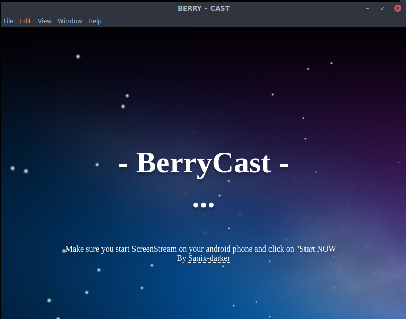
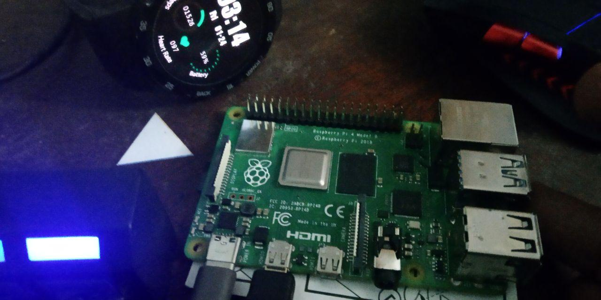
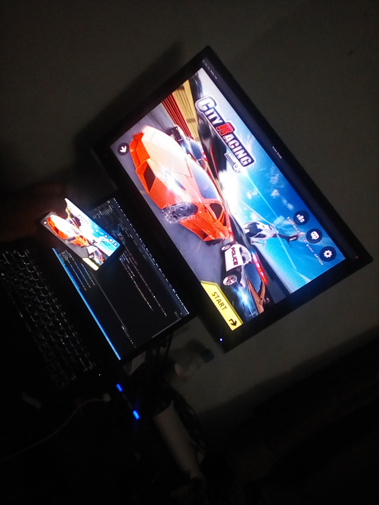
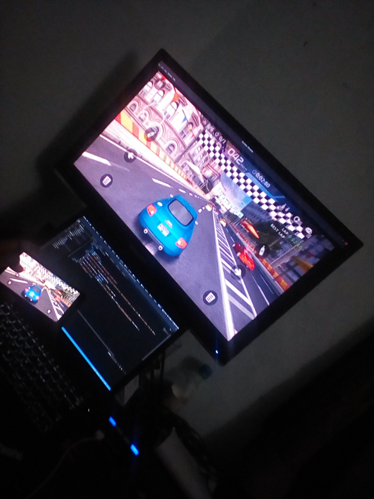
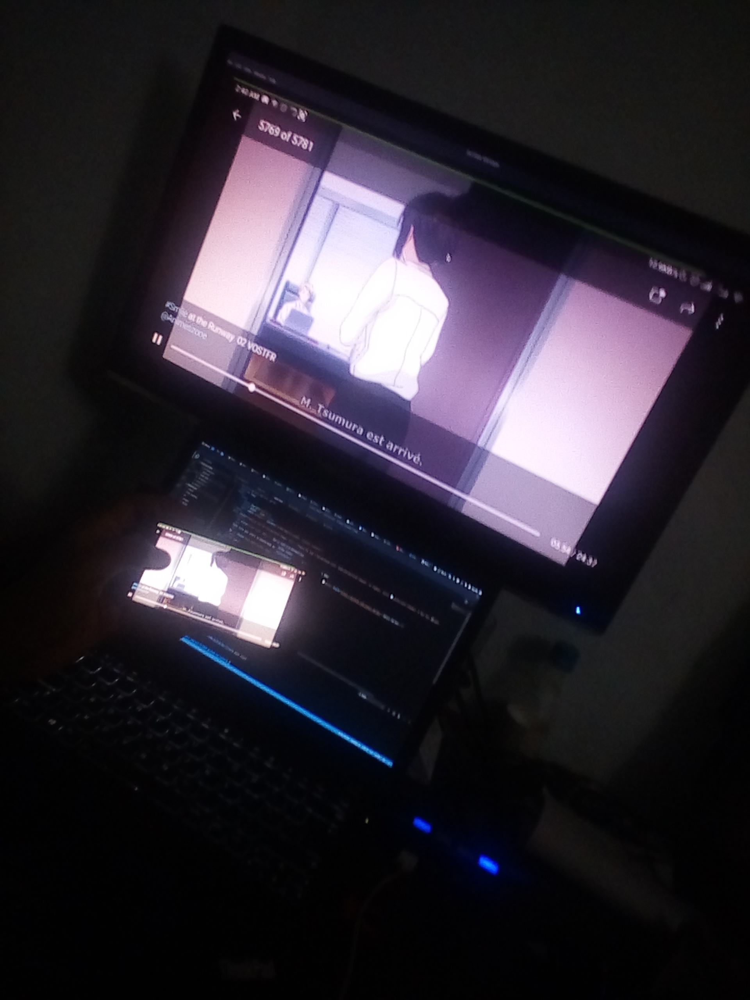
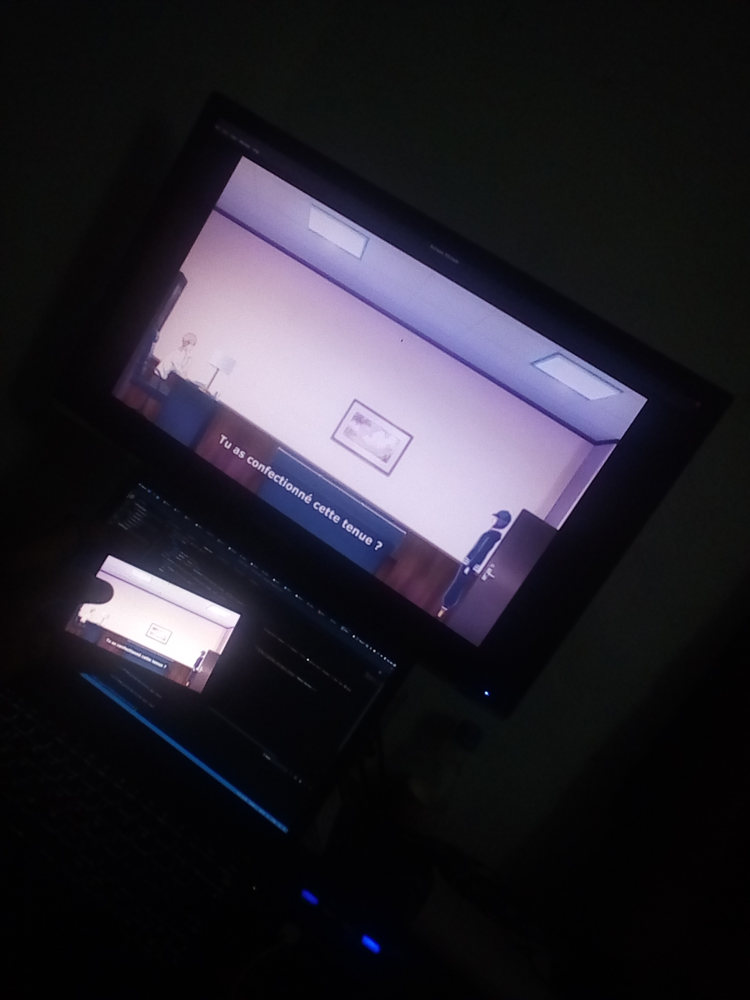

# BerryCast

<center></center>

Stream your mobile on your HDMI Screen using a raspberry pi using WIFI !

**The code is toooooooooooooooooooooooo Simple, LMAO!**

<br>
**NB:** A nice documentation will be provide as soon as possible !

## What you need

- A raspberry pi.
- ScreenStream running on your android device.
- node, npm installed on the raspberry pi.

## How to start it

You just have to run:
```shell
# clone it in your raspberry pi
git clone https://github.com/sanix-darker/berrycast

# Do a cd to the project
cd path/to/the/project

# install dependencies
yarn install
# or npm install

# Then you can start it using
yarn start
# or npm start
```

## Screens of tests

Some screens when i was testing it.
<table>
    <tr>
        <td colspan="2">
            My Raspberry pi 4 (NEON)
            
        </td>
    </tr>
    <tr>
        <td>Gaming...</td>
        <td>Gaming...</td>
    </tr>
    <tr>
        <td>Anime mangas...</td>
        <td>Whatsapp..</td>
    </tr>
</table>

## Author

- Sanix-darker