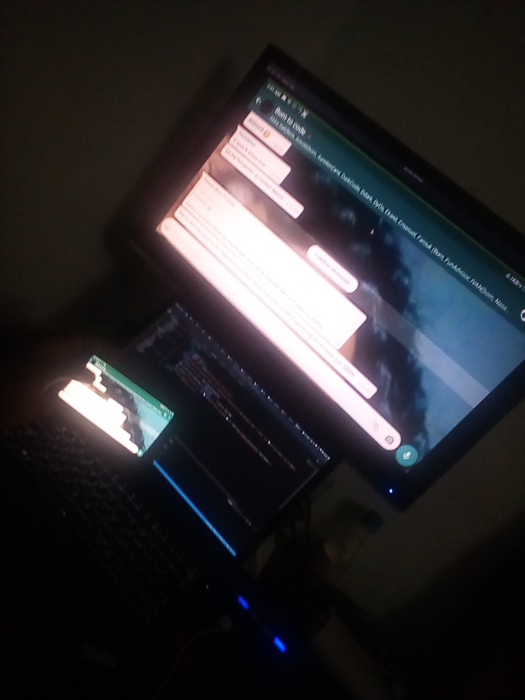

# BerryCast

Stream your mobile on your HDMI Screen using a raspberry pi using WIFI !
**The code is toooooooooooooooooooooooo Simple, LMAO!**

 
**NB:** A nice documentation will be provide as soon as possible !

## What you need

- A raspberry pi.
- ScreenStream running on your android device.
- node, npm installed on the raspberry pi.

## How to start it

You just have to run

## Screens of tests

Some screens when i was testing it.
<table>
    <tr>
        <td colspan="2">
            My Raspberry pi 4 (NEON)
            
        </td>
    </tr>
    <tr>
        <td>Gaming...</td>
        <td>Gaming...</td>
    </tr>
    <tr>
        <td>Anime mangas...</td>
        <td>Whatsapp..</td>
    </tr>
</table>

## Author

- Sanix-darker